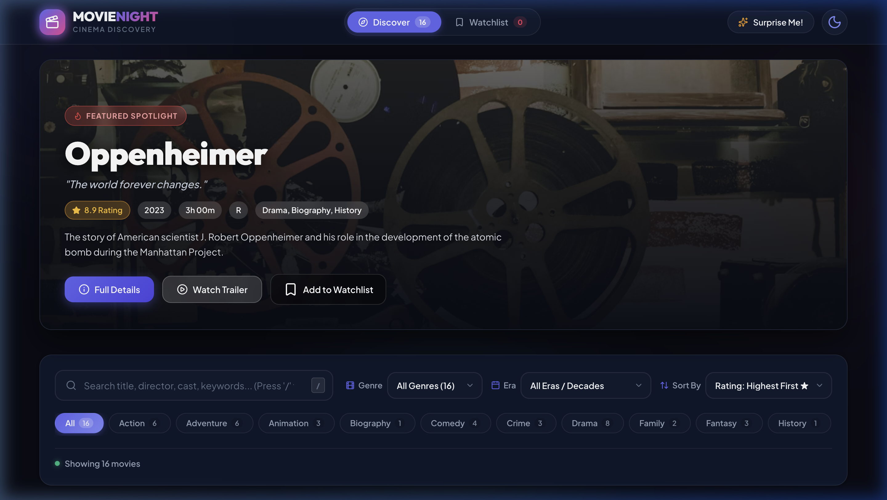
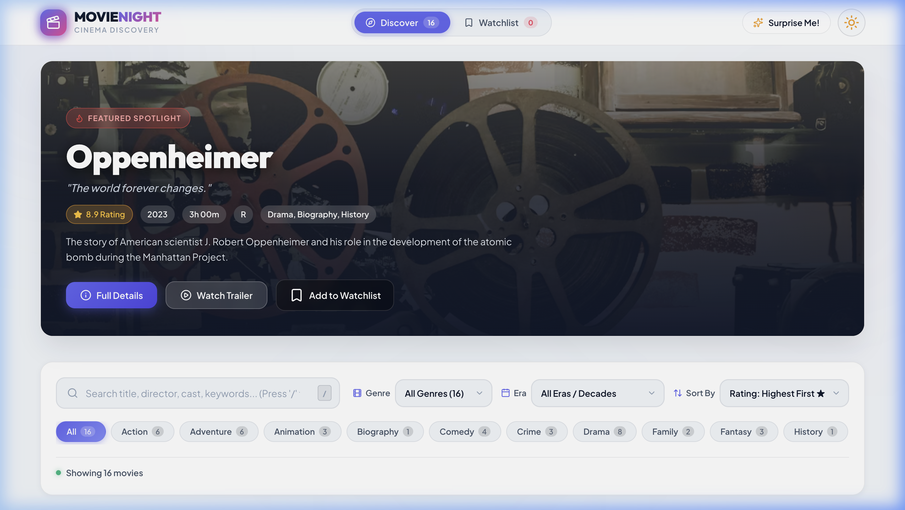
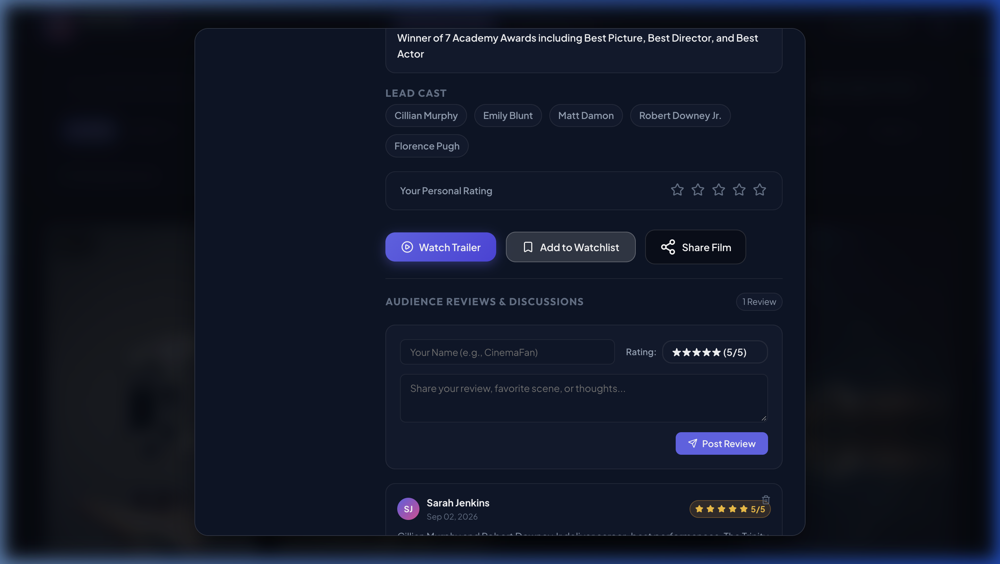

# 🎬 Movie Night — Cinema Discovery & Watchlist App

<p align="center">
  
</p>

<p align="center">
  <b>A sleek, modern, and interactive cinema discovery web application built with pure Vanilla HTML5, modern CSS3 (Custom Design System & CSS Variables), and JavaScript (ES6+).</b>
</p>

<p align="center">
  
  
  
  
  
  
</p>

---

## 🌟 Key Feature Highlights

### 🎰 1. "Surprise Me" Slot-Machine Randomizer
Can't decide on a film for movie night? Tap the **"Surprise Me!"** button in the header. It runs a rapid, authentic **slot-machine roulette shuffle** across movie cards with animated glowing borders, gradually decelerates, smoothly scrolls right to the winning card with a celebratory pulse, and automatically opens the full details modal!

### 💾 2. 100% LocalStorage Persistence
No database or server required. All user actions are instantly synchronized and persisted in browser `localStorage`:
- **Personal Watchlist**: Save or remove films with instant counter badge updates.
- **Theme Preferences**: Automatically remembers your Dark or Light theme choice.
- **Personal Ratings**: Saves your individual 1-to-5 star ratings for each film.
- **User Reviews & Comments**: Retains all submitted audience reviews across page refreshes.

### 💬 3. Audience Reviews & Discussion Board
Inside every movie details modal, users can read community impressions and share their own thoughts:
- **Interactive Review Form**: Submit your name, choose a 1-to-5 star rating, and write your thoughts.
- **Live Review Feed**: Displays reviewer initials avatars, timestamps, star score badges, and quick-delete options.

### 🎥 4. Embedded YouTube Trailer Player
Every movie features a dedicated **"Watch Trailer"** action in the Featured Hero Banner, on card hover overlays, and inside the Details Modal. Clicking it opens a responsive video modal that streams the official trailer without page redirects and halts playback upon closing.

### 🔍 5. Real-Time Search, Genre & Decade Filtering
- **Live Search**: Instant real-time filtering across titles, directors, cast members, and synopses with a shortcut (`/` to focus).
- **Genre Filter Pills**: Filter dynamically across *Sci-Fi, Action, Drama, Thriller, Animation, Adventure, Comedy, Crime, Fantasy, Family, etc.*
- **Decade / Era Selector**: Easily filter movies by release eras (*2020s Modern Hits, 2010s Golden Era, 2000s Millennium Hits, 1990s & Classics*).
- **Multi-Sort**: Sort by IMDb Rating (Highest/Lowest), Release Year (Newest/Oldest), or Title (A–Z / Z–A).

### ✨ 6. Skeleton Shimmer Screens & Illustrated Empty States
- **Skeleton Shimmers**: Animated placeholder cards appear during category transitions for a snappy, native app feel.
- **Helpful Empty States**: Friendly empty state illustrations and quick action buttons when no search results match or when the Watchlist is empty.

---

## 📸 Visual Showcase

<table width="100%">
  <tr>
    <td width="50%" align="center">
      <b>🌙 Dark Mode (Default Theme)</b><br/><br/>
      
    </td>
    <td width="50%" align="center">
      <b>☀️ Light Mode Theme</b><br/><br/>
      
    </td>
  </tr>
  <tr>
    <td colspan="2" align="center">
      <br/>
      <b>💬 Interactive Movie Details Modal & Audience Reviews</b><br/><br/>
      
    </td>
  </tr>
</table>

---

## 🛠️ Technologies & Design System

| Layer | Technology | Highlights |
| :--- | :--- | :--- |
| **Markup** | **HTML5** | Semantic tags, accessible ARIA modal dialogs, SEO metadata |
| **Styling** | **CSS3** | CSS Variables (Theming), Flexbox & Grid, Glassmorphism, Keyframe animations |
| **Logic** | **Vanilla JS (ES6+)** | Pure JavaScript state machine, array filtering pipelines, DOM manipulation |
| **Storage** | **Web Storage API** | `localStorage` persistence for watchlist, themes, ratings, and reviews |
| **Icons** | **Lucide Icons** | Crisp, lightweight SVG iconography |
| **Typography** | **Google Fonts** | *Outfit* (headings) and *Plus Jakarta Sans* (body text) |

---

## 📁 Project Structure

```
Movie-night/
├── index.html        # Semantic HTML5 layout, hero banner, filters bar, modals & toasts
├── styles.css        # CSS design system, dark/light themes, skeletons & animations
├── app.js            # Dataset (16 films), search/filter/sort pipelines, reviews CRUD & state sync
├── README.md         # Documentation, feature highlights & setup guide
├── .gitignore        # Git ignore rules
└── screenshots/      # High-resolution screenshots of the UI
    ├── hero_dark_theme.png
    ├── light_theme_view.png
    └── movie_modal_reviews.png
```

---

## 🚀 Getting Started Locally

### 1. Clone the Repository
```bash
git clone https://github.com/shreyakumari2006/Movie-night.git
cd Movie-night
```

### 2. Run Locally
You can simply open `index.html` in your favorite web browser, or launch a local web server:

```bash
# Using Python 3
python3 -m http.server 8080

# Using Node.js (npx)
npx serve .
```

Open your browser and navigate to **`http://localhost:8080`**.

---

## ⌨️ Keyboard Shortcuts

| Shortcut | Description |
| :---: | :--- |
| <kbd>/</kbd> | Instantly focus and activate the search bar |
| <kbd>ESC</kbd> | Close any open movie detail modal or trailer video |

---

## 📄 License

This project is licensed under the [MIT License](LICENSE) — feel free to use, modify, and build upon it!
